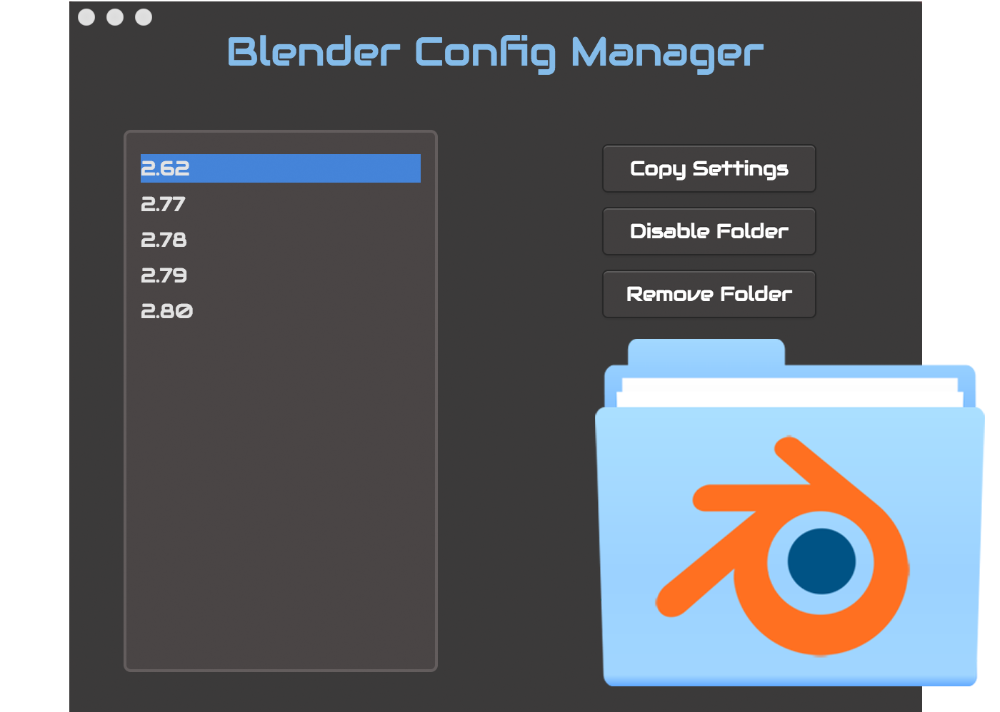

  <h1 style="font-size: 36px;">
  Blender Config Manager
  </h1>
  

  <h3>The Blender Config Manager Desktop Application offers a quick way for Blender
  Users to manage their configuration folders, without the hassle of manual folder management.</h3>
  

    
  

## Installation

Installation is extremely easy. Download the appropriate download for your platform:
Windows .zip, 
OSX [DMG](https://github.com/3DEsprit/blender-config-manager/releases/download/1.0.1/Blender.Config.Manager-1.0.1.dmg), 
Linux [.AppImage](https://github.com/3DEsprit/blender-config-manager/releases/download/1.0.1/blender-config-manager-1.0.1-x86_64.AppImage)).
Execute the file, and follow any directions thereafter. 

## Usage

The most important feature of BCM (Blender Config Manager) is the ability to _remove_, or _disable_ configuration files. To quickly explain how Blender configuration files work, each version of Blender will create its own configuration folder with the name set as the version number. Each one of these folders is usually placed in a folder not usually visited by the common user, and in turn can be hidden for many throughout their Blender career. 

Instead of ever needing to know where these folders are, BCM will manage these for you no matter what the platform, and gives you functionality to make your configuration needs much easier.

### Features

Upon opening BCM, you would find yourself faced with the Blender configuration folders available. 

_NOTE: If you have never opened Blender on the system being used, no folders will show._

When selecting a Blender configuration version folder, you will be given three different options:

#### Copy Settings

The *Copy Settings* option allow you to copy settings from one folder to another. This is most helpful after upgrading Blender, and you forgot to hit the "Copy Settings" button within Blender. To use this feature, select the folder you want to copy from, click _Copy Settings_, select the folder you want to copy the settings to, and then click the _Copy Settings_ button at the bottom. After clicking the 2nd button, you will be prompted with a dialog asking you if you are sure you want to copy settings.

This particular option will copy EVERYTHING, including scripts, and settings. Basically what Blender will do from the Splash screen option.

#### Disable Folder

The second option allows you to disable a settings folder. This will simply rename the folder giving it a *-old* suffix. Because of this, Blender will not see the folder, and allow you to create a new folder. While this option is to "Disable" a folder, this is a great way to actually backup a setting folder. Keep in mind you can only disable a folder if it is the ONLY folder for that version, and there isn't an existing disabled folder. 

_NOTE: Just like the disable function, there is an Enable function for each disabled settings folder._

#### Remove Folder

If you want to git rid of a configuration folder,you can remove a settings folder with the 3rd option. This is a great remedy for those times when a default config has been created for a new or older version, and you do not want the default options. 

In the case of BCM, this is really only useful for getting rid of extra folders when you want to re-enable a folder with settings years old.

## Wish List

Even though BCM offers all that is really needed, there are a few extra features that would be nice to have.

- Backup Option (to backup outside the default config folder)
- Copy Scripts Option (don't overwrite settings)
- Native FreeBSD Support

